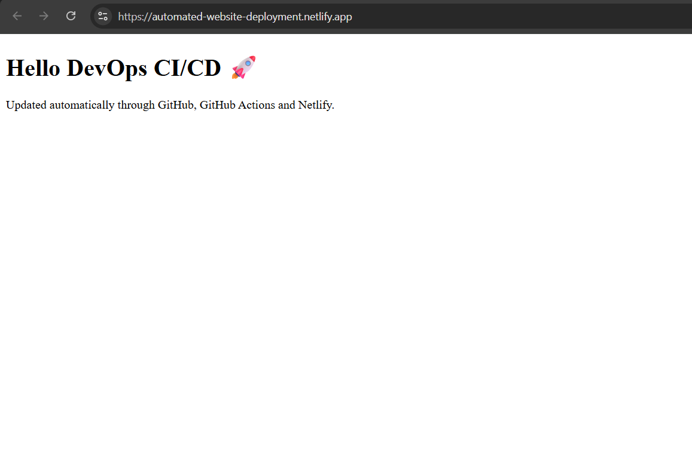
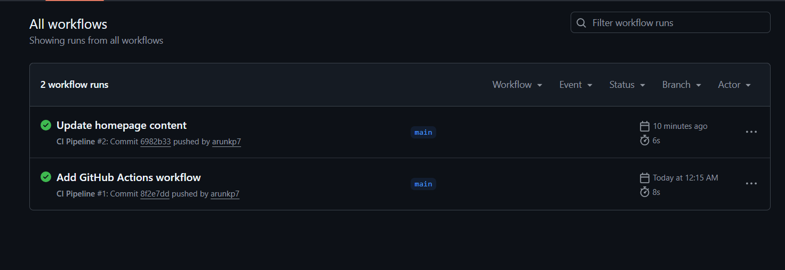
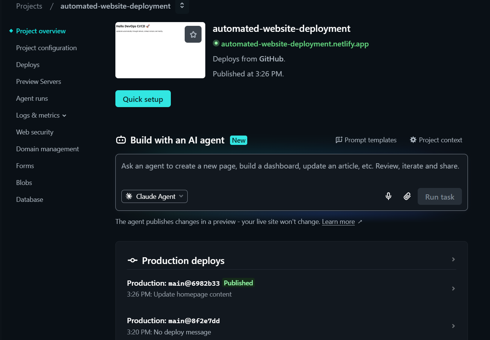

# Automated Website Deployment using GitHub Actions and Netlify

## Project Overview

This project demonstrates a simple CI/CD pipeline for a static website.

Whenever code is pushed to the GitHub repository:

1. GitHub Actions automatically triggers a workflow.
2. The workflow executes CI steps.
3. Netlify detects the repository changes.
4. The latest version of the website is automatically deployed.

## Technologies Used

- Git
- GitHub
- GitHub Actions
- Netlify
- HTML

## Project Structure

```text
.
├── .github
│   └── workflows
│       └── deploy.yml
├── index.html
├── .gitignore
└── README.md
```

## CI/CD Workflow

```text
Developer
    ↓
Git Push
    ↓
GitHub Repository
    ↓
GitHub Actions
    ↓
Netlify Deployment
    ↓
Live Website
```

## GitHub Actions Workflow

The workflow is located in:

```text
.github/workflows/deploy.yml
```

It automatically runs whenever code is pushed to the `main` branch.

## Live Website

https://automated-website-deployment.netlify.app/

## Screenshots

### Website



### GitHub Actions



### Netlify Deployment



## Learning Outcomes

Through this project I learned:

- Git fundamentals
- GitHub repository management
- GitHub Actions workflows
- CI/CD concepts
- Automated deployments
- Netlify hosting

## Future Improvements

- Add HTML linting
- Add staging environment
- Add Docker-based deployment
- Add automated testing

## Author

Arun Kumar Pal